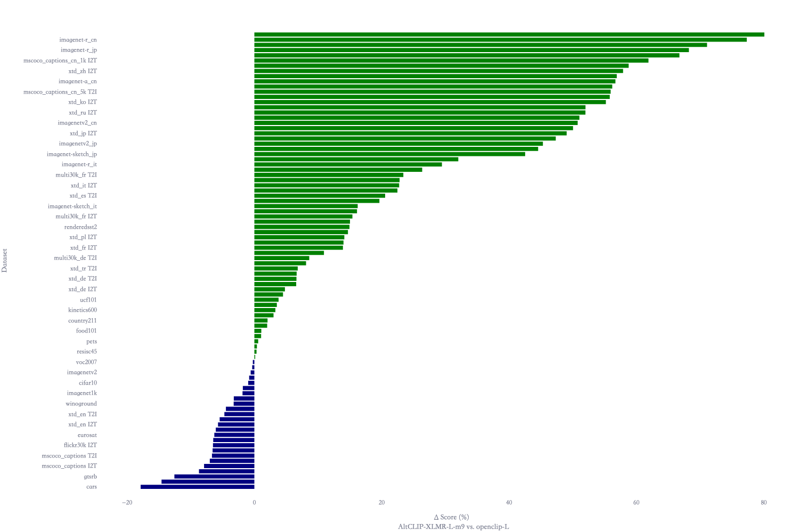

# Visualization
The tutorial provides guidance to visualize the results of `Evaluation` process. With visualization, users can have a better comprehension of performances in multiple dimensions, such as different languages, different tasks, vision encoder sizes, text encoder structure, etc.

The entry file of visualization is [visual.py](visual.py), with the results of evaluation in json files as input, and build a `streamlit` web application. 

## Parameters
* `--json` to specify the input evaluation results with json files, separated by ',', for example, `--json=file1.json,file2.json`.
    * [Tips] wildcard variables is supported, you can use "*", "?":

        ```
        streamlit run visual.py -- --json="outputs/*.json"
        ```
* `--jsonl` to specify the input with a `jsonl` file, in which each line is a json format evaluation result.

* [Tips] To use either `--json` or `--jsonl`.

## Example

Here is an example of visualization.

First, you need to need to install the packages to support visualization:

`pip install -r requirements_visual.txt`

Second, you should prepare evaluation result files. In this example, we take two evaluation result files named `AltCLIP-XLMR-L.json` and `openclip-L.json`.

Then, you can run the visualization module by providing the evaluation file names:

`streamlit run visual.py -- --json=AltCLIP-XLMR-L.json,openclip-L.json`


[Tips] jsonl file input is also supported, you can use `--jsonl=[JSONL_FILE]` to initialize.

The default url of web application is: `http://localhost:8501/`

Here is the snapshot of the visualization webpages.

